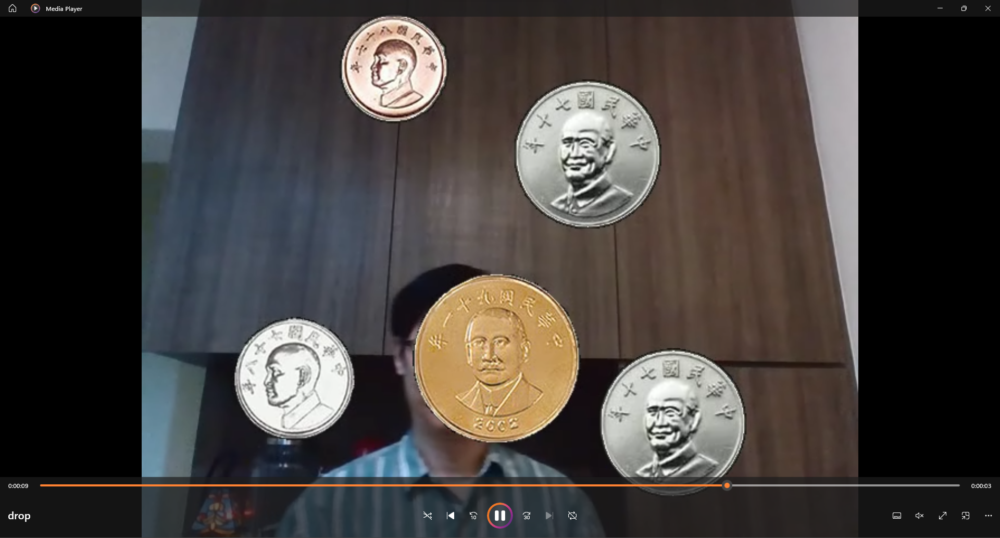

# 作業4：Opencv/C++天降錢幣

|姓名|學號|
|:---:|:---:|
|吳宇昕|B10831020|

**僅完成Level1**

__原始碼__
[Level1](Level1/HW4_level1_guide.cpp)

__執行結果：__


__說明__

1. 將讀取錢幣影像的程式碼獨立寫成函式：

    函式的兩個參數```_coins_out```與```_coinsBin_out```分別是儲存各個錢幣影像與前景遮罩的```std::vector<cv::Mat>```。用range-based for loop走訪所有讀到的錢幣影像，產生其遮罩。
``` c++
void loadCoinImgs(std::vector<cv::Mat>& _coins_out, std::vector<cv::Mat>& _coinsBin_out)
{
	_coins_out.reserve(4);
	_coinsBin_out.reserve(4);
	_coins_out.push_back(cv::imread(COIN01_PATH, 1)); 
	_coins_out.push_back(cv::imread(COIN05_PATH, 1)); 
	_coins_out.push_back(cv::imread(COIN10_PATH, 1)); 
	_coins_out.push_back(cv::imread(COIN50_PATH, 1)); 
	cv::Mat tmp;
	for (cv::Mat aCoinImg : _coins_out){
		cv::cvtColor(aCoinImg, tmp, cv::COLOR_BGR2GRAY);
		threshold(tmp, tmp, 10, 255, cv::THRESH_BINARY);
		_coinsBin_out.push_back(tmp.clone());
	}
}
```

2. 將決定錢幣隨機生成的程式碼寫成獨立函式：

    使用std::mt19937亂數產生器，決定隨機生成錢幣的時間點、種類與水平位置。其中```CoinSpawnInfo```是自定義的struct，包含上述三個欄位。參數```_coinSpawnInfo```是儲存所有隨機錢幣生成資訊的```std::vector<CoinSpawnInfo```，得到所有生成資訊後，利用```std::sort```以錢幣的生成的時間點由先到後排序。
```c++
void determineCoinSpawn(std::array<CoinSpawnInfo, COINS_COUNT>& _coinSpawnInfo, const int _FRAME_COUNT, const int _FRAME_WIDTH)
{
	auto rng = std::mt19937(time(0));
	for (CoinSpawnInfo& coinInfo : _coinSpawnInfo)
	{
		coinInfo.SpawnFrame = rng() % (_FRAME_COUNT - 100);   
		coinInfo.CoinType   = rng() % 4;                       
		coinInfo.x          = rng() % (_FRAME_WIDTH - 150); 
	}

	std::sort(_coinSpawnInfo.begin(), _coinSpawnInfo.end(), frameLarger);
}
```

3. 將把錢幣影像貼近畫面的程式碼寫成獨立函式

    顯示每個畫面時執行此函式，把錢幣貼進顯示畫面```_imBg_out```裡。參數```_frameIdx```表示當下的第幾貞，用來決定畫面上的錢幣垂直位置。用range-based for loop檢視每一個錢幣的生成資訊，若該錢幣的生成時間點未到，其垂直位置```y```將為負數，因此不將其錢幣影像貼到畫面上。而當畫面上的錢幣已經掉至接近影片的下邊界，待其```y```小於```_frameHeight - 150```後即將其從畫面上去除。
```c++
inline void spawnCoinsOnFrame(
	cv::Mat& _imBg_out, 
	const std::array<CoinSpawnInfo, COINS_COUNT>& _coinSpawnInfo, 
	const std::vector<cv::Mat>& _coins,
	const std::vector<cv::Mat>& _coinsMasks,
	const size_t& _frameIdx, 
	const size_t& _frameHeight)
{
	for (const CoinSpawnInfo& aCoinInfo : _coinSpawnInfo)
	{
		int y = 5 * (_frameIdx - aCoinInfo.SpawnFrame);
		if (y > 0 && y < _frameHeight - 150)
		{
			cv::Mat coinRoi = cv::Mat(_imBg_out, cv::Rect(aCoinInfo.x, y, _coins[aCoinInfo.CoinType].cols, _coins[aCoinInfo.CoinType].rows));
			_coins[aCoinInfo.CoinType].copyTo(coinRoi, _coinsMasks[aCoinInfo.CoinType]);
		}
	}
}
```